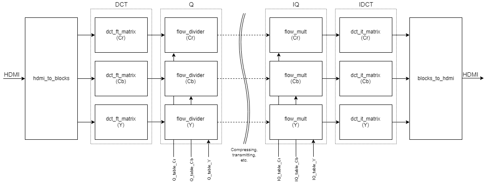
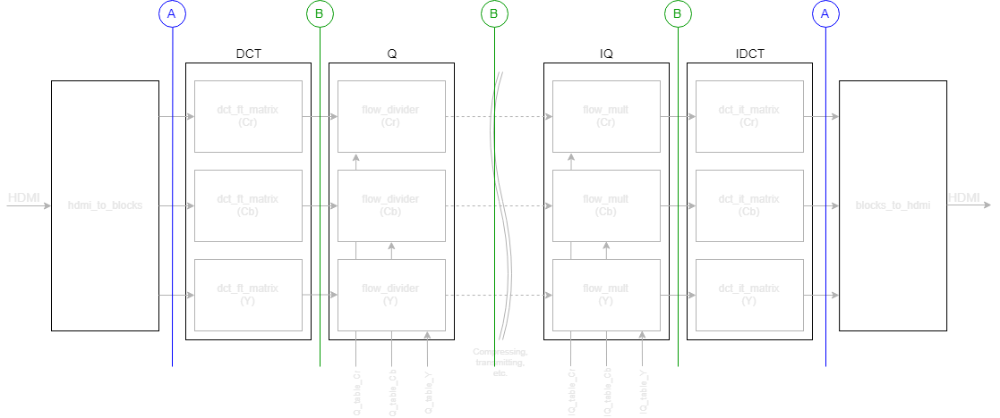
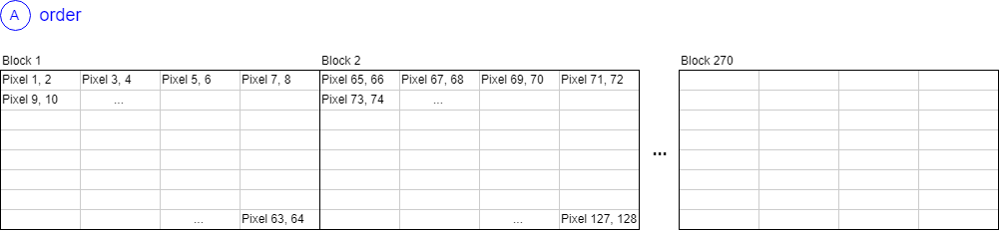

# Welcome to JPEG modification project repository

This repository is a part of JPEG modification project. It contains RTL code for HDMI converters, DCT & IDCT and multiplier & divider modules for quantization. 

For simulation we used Modelsim PE 10.4a, you can find .tcl scripts for it in the corresponding folders, in **./sim/** subfolders. 

## Data flow description

The system has a parameter **N**, which defines the width of all data buses in pixels. All modules were designed to work with the value of N=2 and was not tested with other values. However, possible values are: 2, 4 and 8. The pictures bellow describe pixel order in the data flow of the system.

## DCT 
 
We use the BinDCT - fast implementation without multipliers. The description of the algorithm can be found in articles:
[FAST MULTIPLIERLESS APPROXIMATION OF THE DCT](https://pdfs.semanticscholar.org/44e0/0a04aa944d1d20531326faae10a23e2e209d.pdf) and [The BinDCT: FAST MULTIPLIERLESS APPROXIMATION OF THE DCT](http://citeseerx.ist.psu.edu/viewdoc/download?doi=10.1.1.41.8531&rep=rep1&type=pdf)

## Synthesis results
The whole system was synthesized in Quartus II for Arria V family. You can find the project in the **./quartus** folder. Some modules could be synthesized individually with better performance.

|                    | Balanced mode | Performance high effort mode |
| ------------------ | ------------- | ---------------------------- |
| Max frequency, MHz | *158*         | *165*                        |
| ALMs               | *10,887*      | *10,910*                     |
| Block memory, bits | 1,676,100     | 1,676,100                    |
| DSPs               | 8             | 8                            |

## Useful links

* [VESA DMT standard](http://gfiles.chinaaet.com/crazybingo/group/20170606/334-6363235373199427985140055.pdf)
* [FAST MULTIPLIERLESS APPROXIMATION OF THE DCT](https://pdfs.semanticscholar.org/44e0/0a04aa944d1d20531326faae10a23e2e209d.pdf)
* [The BinDCT: FAST MULTIPLIERLESS APPROXIMATION OF THE DCT](http://citeseerx.ist.psu.edu/viewdoc/download?doi=10.1.1.41.8531&rep=rep1&type=pdf)